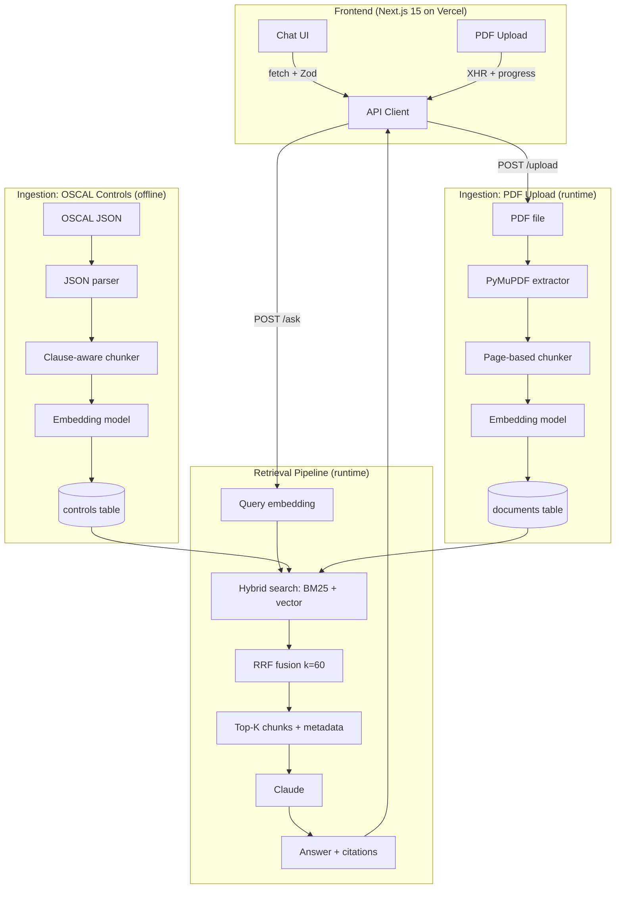

# iso-audit-rag

> When compliance gets complex, how do you find the right clause?

Upload any compliance standard, ask in plain English, and get answers with exact clause citations — powered by hybrid retrieval and Claude.

<p align="center">
  <a href="https://iso-audit.manumustudio.com"><strong>Live Demo</strong></a> · <a href="https://api.iso-audit.manumustudio.com/docs"><strong>API Docs</strong></a> · <a href="https://github.com/manumu-studio/iso-audit-rag"><strong>Source Code</strong></a>
</p>

---

<p align="center">
  
</p>

---

## What it does

A retrieval-augmented generation pipeline ingests **NIST SP 800-53 Rev 5** controls from OSCAL JSON and user-uploaded PDFs, embeds them with OpenAI `text-embedding-3-small`, and stores chunks in PostgreSQL with pgvector. At query time, hybrid search (BM25 + cosine similarity) retrieves the most relevant clauses, Reciprocal Rank Fusion merges the two result sets, and **Claude** generates a cited answer — streamed token-by-token via SSE.

The chat UI lets compliance teams ask natural-language questions and immediately see which controls and clauses support the answer.

## Landing Page

Calibre-inspired dark theme with constellation canvas animation, gradient hero, feature showcase, how-it-works pipeline, and tech badges.

<p align="center">
  
</p>

<p align="center">
  
</p>

<p align="center">
  
</p>

<p align="center">
  
</p>

## Chat UI

Sidebar navigation, suggested prompts, PDF upload with progress, citation pills that expand to a detail panel, and streaming responses with a typing caret.

<p align="center">
  
</p>

<p align="center">
  
</p>

## Architecture



## Tech Stack

| Layer | Choice |
|------|--------|
| Language / runtime | Python 3.13 |
| API framework | FastAPI + Pydantic v2 |
| Database | PostgreSQL 17 + pgvector (Neon in production) |
| Embeddings | OpenAI `text-embedding-3-small` |
| Generation | Anthropic Claude (`claude-sonnet-4-6`) |
| Retrieval | Hybrid BM25 + vector with RRF fusion |
| Frontend | Next.js 15 + React 19 + Tailwind 4 (Vercel) |
| Deployment | EC2 (Nginx + systemd) |

## Quickstart

```bash
# 1. Clone the repo
git clone https://github.com/<you>/iso-audit-rag.git
cd iso-audit-rag

# 2. Backend — configure secrets
cd backend
cp .env.example .env
# Edit .env (OPENAI_API_KEY, ANTHROPIC_API_KEY, DATABASE_URL when applicable)

# 3. Start Postgres + pgvector (run compose from backend/)
docker compose up db -d

# 4. Install Python dependencies (backend/.venv)
uv sync

# 5. Run the API
uv run uvicorn app.main:app --reload

# 6. Smoke-test the health endpoint
curl http://localhost:8000/health
# -> {"status":"ok"}

# 7. Frontend (separate terminal)
cd ../frontend
npm install
cp .env.example .env.local
# NEXT_PUBLIC_API_URL=http://localhost:8000 for local API
npm run dev
# Landing page: http://localhost:3000 — Chat demo: http://localhost:3000/chat
```

## Development

```bash
# Backend
cd backend
ISO_AUDIT_TESTING=1 uv run pytest -v
uv run ruff check .
uv run mypy --strict app/ scripts/ tests/

# Frontend
cd frontend
npm run lint
npm run type-check
npm run build
```

## Data Source

The corpus is **NIST SP 800-53 Rev 5** in OSCAL JSON format (the official machine-readable
release of the control catalog). Ingestion is clause-aware — every chunk keeps its control
ID (e.g. `AC-2`) and statement label so retrieved answers can cite the exact clause they
came from.
