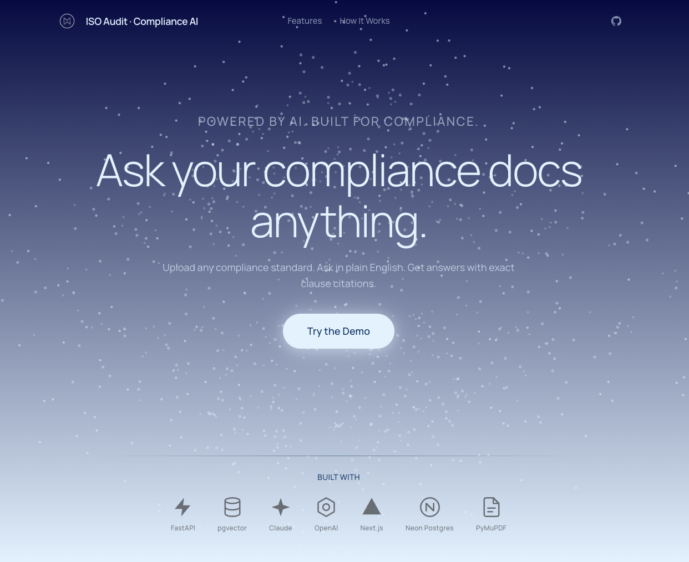
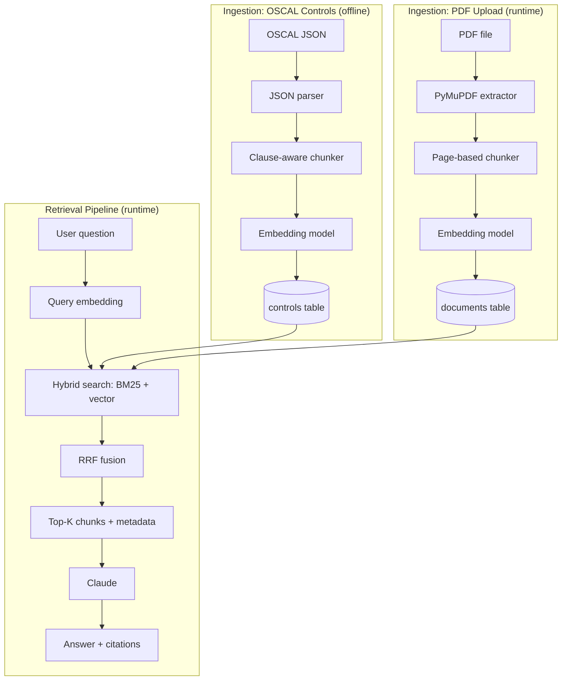
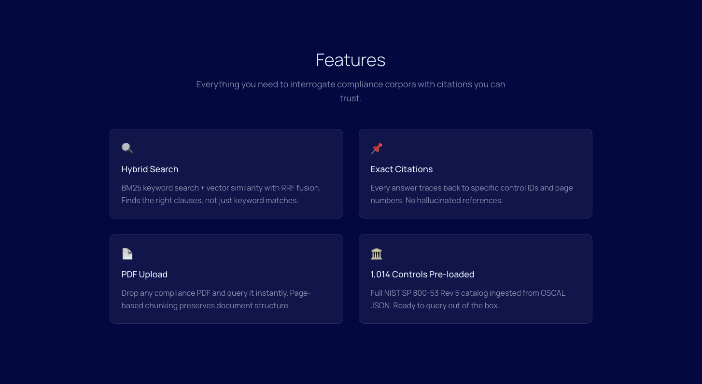
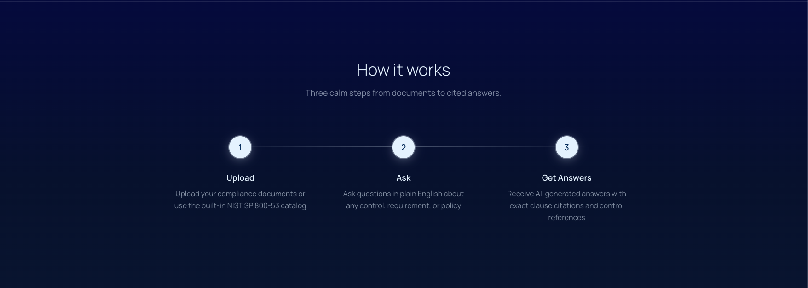
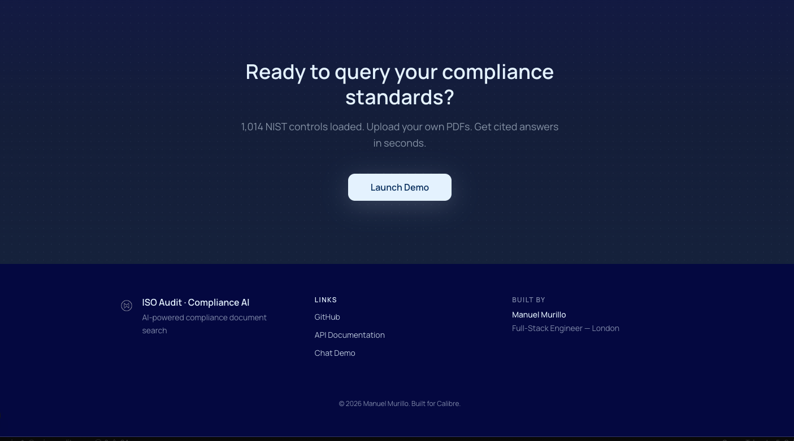
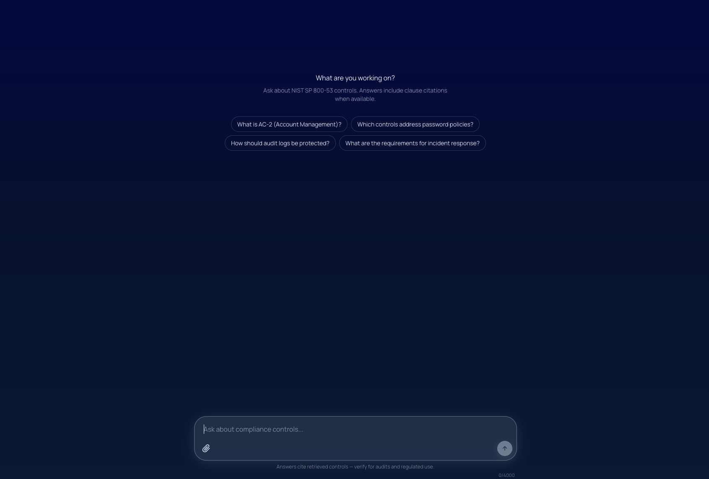
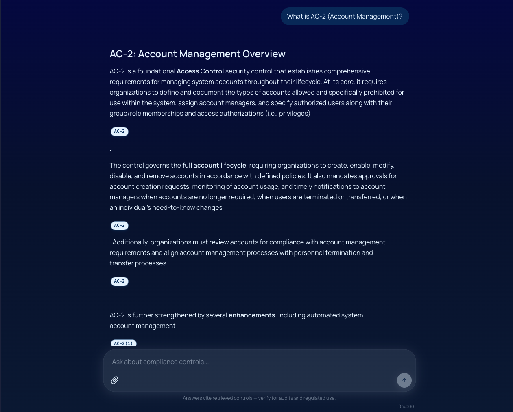
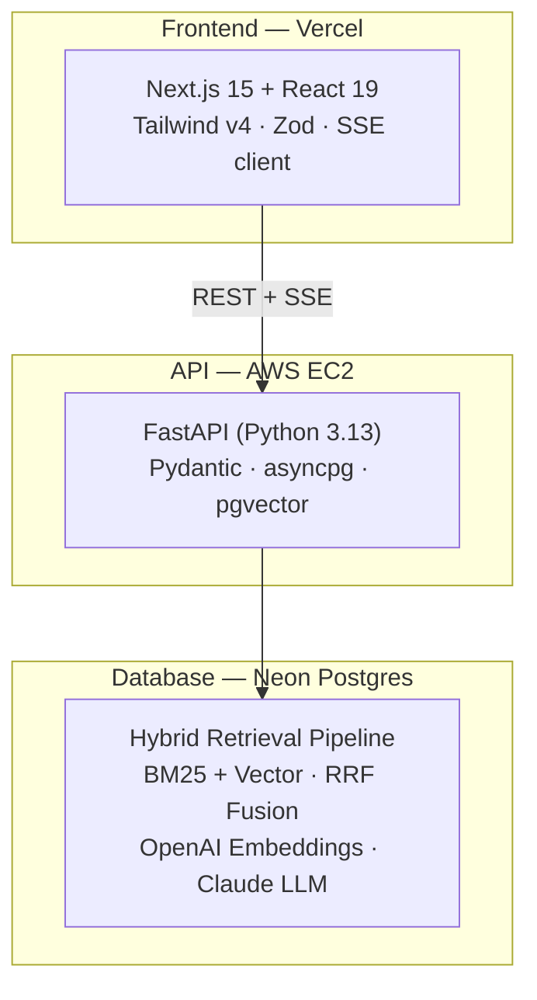

# ISO Audit RAG

> When compliance gets complex, how do you find the right clause?

Upload any compliance standard, ask in plain English, and get answers with exact clause citations — powered by hybrid retrieval and Claude.

<p align="center">
  <a href="https://iso-audit.manumustudio.com"><strong>Live Demo</strong></a> · <a href="https://api.iso-audit.manumustudio.com/docs"><strong>API Docs</strong></a> · <a href="https://github.com/manumu-studio/iso-audit-rag"><strong>Source Code</strong></a>
</p>

---

<p align="center">
  
</p>

---

## What it does

A retrieval-augmented generation pipeline ingests **NIST SP 800-53 Rev 5** controls from OSCAL JSON and user-uploaded PDFs, embeds them with OpenAI `text-embedding-3-small`, and stores chunks in PostgreSQL with pgvector. At query time, hybrid search (BM25 + cosine similarity) retrieves the most relevant clauses, Reciprocal Rank Fusion merges the two result sets, and **Claude** generates a cited answer — streamed token-by-token via SSE.

The chat UI lets compliance teams ask natural-language questions and immediately see which controls and clauses support the answer.



## Landing Page

Calibre-inspired dark theme with constellation canvas animation, gradient hero, feature showcase, how-it-works pipeline, and tech badges.

<p align="center">
  
</p>

<p align="center">
  
</p>

<p align="center">
  
</p>

<p align="center">
  
</p>

## Chat UI

Sidebar navigation, suggested prompts, PDF upload with progress, citation pills that expand to a detail panel, and streaming responses with a typing caret.

<p align="center">
  
</p>

<p align="center">
  
</p>

## Architecture



## API

| Endpoint | Method | Description |
|---|---|---|
| `/health` | GET | Health check |
| `/ask` | POST | Ask a question — returns JSON with answer + citations |
| `/ask/stream` | POST | Ask a question — streams answer tokens via SSE |
| `/upload` | POST | Upload a PDF document for retrieval |

Interactive docs at [`/docs`](https://api.iso-audit.manumustudio.com/docs) (Swagger UI).

## Stack

| Layer | Technology |
|---|---|
| **Frontend** | Next.js 15, React 19, TypeScript (strict), Tailwind CSS v4, Zod, Motion |
| **Backend** | Python 3.13, FastAPI, Pydantic v2, asyncpg, PyMuPDF |
| **Embeddings** | OpenAI `text-embedding-3-small` (1536-dim) |
| **Generation** | Anthropic Claude (`claude-sonnet-4-6`) with SSE streaming |
| **Retrieval** | Hybrid BM25 + pgvector cosine similarity, RRF fusion (k=60) |
| **Database** | PostgreSQL 17 + pgvector (Neon in production) |
| **Infra** | Vercel (frontend), EC2 + Nginx + systemd + Let's Encrypt (API), GitHub Actions CI |
| **Quality** | pytest (34 tests), Vitest + RTL (21 tests), Husky pre-commit hooks, ruff + mypy, ESLint + tsc |

## Quick start

```bash
# Backend
cd backend
cp .env.example .env  # fill in OPENAI_API_KEY, ANTHROPIC_API_KEY, DATABASE_URL
docker compose up db -d
uv sync
uv run uvicorn app.main:app --reload
curl http://localhost:8000/health  # → {"status":"ok"}

# Frontend (separate terminal)
cd frontend
npm install
echo 'NEXT_PUBLIC_API_URL=http://localhost:8000' > .env.local
npm run dev
# Landing: http://localhost:3000 — Chat: http://localhost:3000/chat
```

## Development

```bash
# Backend
cd backend
ISO_AUDIT_TESTING=1 uv run pytest -v        # 34 tests
uv run ruff check .
uv run mypy --strict app/ scripts/ tests/

# Frontend
cd frontend
npm run type-check
npm run lint
npm run build
npm test                                      # 21 tests
```

## Project structure

```
backend/
  app/
    main.py          # FastAPI factory, CORS, lifespan
    routes.py        # /ask, /ask/stream, /upload, /health
    search.py        # Hybrid BM25 + vector retrieval
    llm.py           # Claude generation (sync + streaming)
    chunker.py       # OSCAL JSON → clause-aware chunks
    pdf.py           # PDF extraction + page-based chunking
    embeddings.py    # OpenAI embedding client
    models.py        # Pydantic request/response schemas
    db.py            # asyncpg pool management
  tests/             # pytest suite (30 pipeline + 4 streaming)
  scripts/           # Ingestion CLI, schema setup

frontend/
  src/
    app/
      (landing)/     # Landing page (hero, features, how-it-works)
      (chat)/chat/   # Chat demo with streaming responses
    components/
      Chat/          # Chat shell, message list, input
      MessageBubble/ # User + assistant message rendering
      CitationPanel/ # Expandable citation detail sidebar
      CitationPill/  # Inline citation badges
      UploadButton/  # PDF upload with XHR progress
      EmptyState/    # Suggested prompts
      landing/       # 8 landing page sections
    lib/
      api/           # Typed fetch client, SSE parser, Zod schemas
```

## Architecture decisions

Key decisions are documented in [`docs/research/DECISIONS.md`](docs/research/DECISIONS.md):

- **Hybrid retrieval over vector-only** — BM25 catches exact control IDs that embeddings miss
- **RRF fusion over learned re-ranking** — zero training data required, deterministic merging
- **Clause-aware chunking** — every chunk retains its control ID and statement label for citation
- **SSE over WebSockets** — simpler proxy behavior for single request-response streaming
- **OSCAL JSON as source of truth** — machine-readable, version-controlled NIST catalog

## Data source

The corpus is **NIST SP 800-53 Rev 5** in OSCAL JSON format (the official machine-readable release of the control catalog). Ingestion is clause-aware — every chunk keeps its control ID (e.g. `AC-2`) and statement label so retrieved answers can cite the exact clause they came from. Users can also upload their own compliance PDFs for retrieval.

## Built by

[Manuel Murillo](https://manumustudio.com) — built for [Calibre](https://calibre.ac).

## License

MIT
