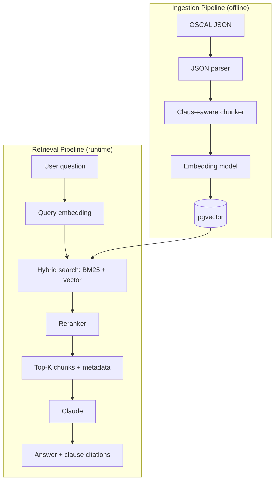

# iso-audit-rag

RAG-powered API for querying NIST SP 800-53 compliance controls with natural language. Returns answers with exact clause citations.

## Architecture



## Tech Stack

| Layer | Choice |
|------|--------|
| Language / runtime | Python 3.13 |
| API framework | FastAPI + Pydantic v2 |
| Database | PostgreSQL 17 + pgvector (Neon in production) |
| Embeddings | OpenAI `text-embedding-3-small` |
| Generation | Anthropic Claude (`claude-sonnet-4-6`) |
| Retrieval | Hybrid BM25 + vector with RRF fusion |
| Frontend | Next.js chat UI on Vercel |
| Deployment | EC2 (Nginx + systemd) |

## Quickstart

```bash
# 1. Clone the repo
git clone https://github.com/<you>/iso-audit-rag.git
cd iso-audit-rag

# 2. Configure secrets
cp .env.example .env
# then edit .env and fill in OPENAI_API_KEY and ANTHROPIC_API_KEY

# 3. Start Postgres + pgvector
docker compose up db -d

# 4. Install Python dependencies (uv-managed virtualenv)
uv sync

# 5. Run the API
uv run uvicorn app.main:app --reload

# 6. Smoke-test the health endpoint
curl http://localhost:8000/health
# -> {"status":"ok"}
```

## Development

```bash
# Run the test suite
uv run pytest -v

# Lint
uv run ruff check .

# Strict type-check
uv run mypy --strict app/ scripts/ tests/
```

## Production deployment

The backend is designed to run behind Nginx on Ubuntu with systemd and to deploy from GitHub Actions after CI passes on `main`. See **[docs/deployment/RUNBOOK.md](docs/deployment/RUNBOOK.md)** for EC2, DNS, Neon, OIDC, and validation steps.

## Data Source

The corpus is **NIST SP 800-53 Rev 5** in OSCAL JSON format (the official machine-readable
release of the control catalog). Ingestion is clause-aware — every chunk keeps its control
ID (e.g. `AC-2`) and statement label so retrieved answers can cite the exact clause they
came from.
