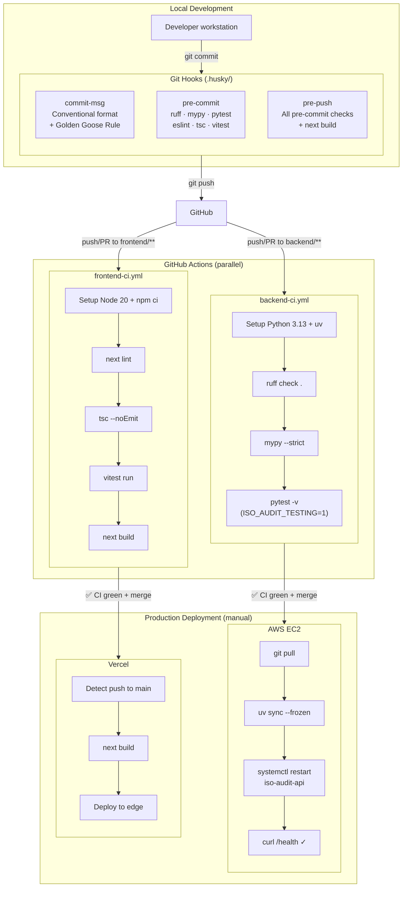
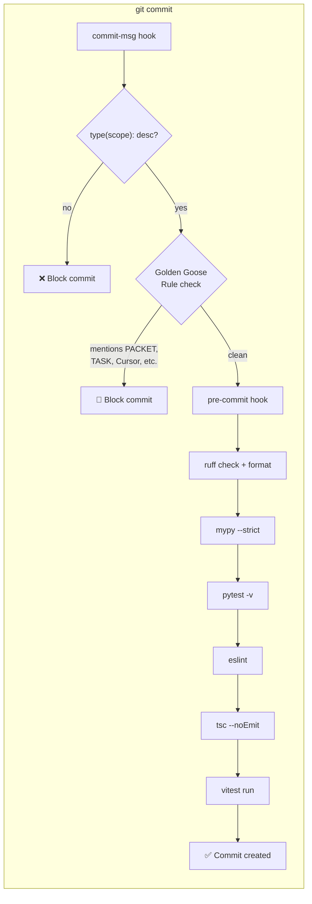
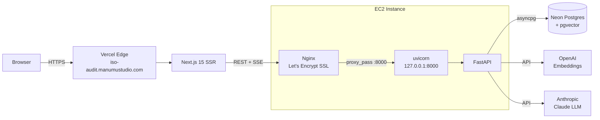

# CI/CD Pipeline

How code moves from local development to production.

## Pipeline Overview

## Trigger Matrix

| Event | backend-ci | frontend-ci |
|-------|-----------|-------------|
| Push to `backend/**` | ✅ | — |
| Push to `frontend/**` | — | ✅ |
| PR targeting either path | ✅ | ✅ |
| Workflow file changed | ✅ | ✅ |

## Git Hook Enforcement

## Production Infrastructure

## Environment Variables

| Variable | Where | Purpose |
|----------|-------|---------|
| `DATABASE_URL` | EC2 `.env` | Neon Postgres connection string |
| `OPENAI_API_KEY` | EC2 `.env` | Embedding model access |
| `ANTHROPIC_API_KEY` | EC2 `.env` | Claude LLM access |
| `ENVIRONMENT` | EC2 `.env` | `dev` or `prod` |
| `NEXT_PUBLIC_API_URL` | Vercel dashboard | Backend API URL for frontend |
| `ISO_AUDIT_TESTING` | CI only | Skips DB pool init in tests |

## Security Headers (Vercel)

Applied via `vercel.json` to all routes:

| Header | Value | Purpose |
|--------|-------|---------|
| `X-Content-Type-Options` | `nosniff` | Prevent MIME sniffing |
| `X-Frame-Options` | `DENY` | Prevent clickjacking |
| `Referrer-Policy` | `strict-origin-when-cross-origin` | Privacy-aware referrer |
