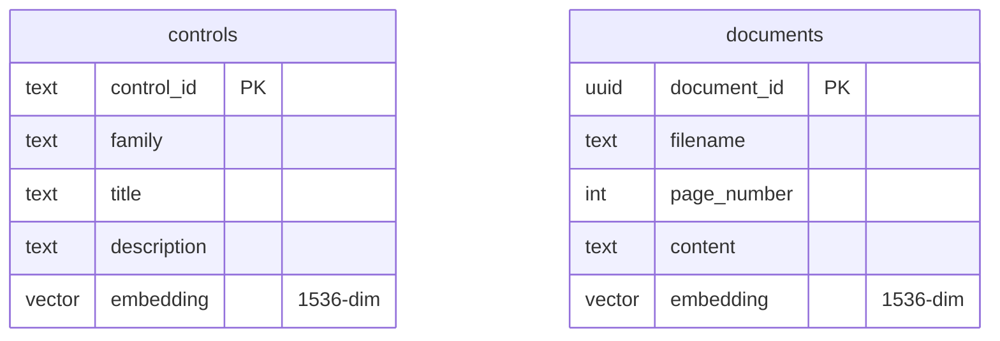

# Data Pipeline

How compliance documents are ingested, chunked, embedded, and stored for retrieval.

## Ingestion Overview

```mermaid
flowchart TB
  subgraph offline["Offline Ingestion (OSCAL Controls)"]
    direction TB
    oscal[NIST SP 800-53 Rev 5<br/>OSCAL JSON catalog] --> parser[JSON parser<br/>chunker.py]
    parser --> filter{Withdrawn?}
    filter -->|yes| discard[Discard]
    filter -->|no| format[Format control ID<br/>ac-2.1 → AC-2&#40;1&#41;]
    format --> extract[Extract description<br/>statement prose ∥ title fallback]
    extract --> chunk_c[Clause-aware chunks<br/>Each retains control_id + family]
    chunk_c --> embed_c["OpenAI text-embedding-3-small<br/>(1536-dim vectors)"]
    embed_c --> controls[(controls table<br/>pgvector HNSW index)]
  end

  subgraph runtime_upload["Runtime Ingestion (PDF Upload)"]
    direction TB
    pdf[User PDF file] --> validate{Validate<br/>extension · size · magic bytes}
    validate -->|fail| reject["❌ 413 / 415 / 422"]
    validate -->|pass| extract_pdf[PyMuPDF text extraction<br/>pdf.py]
    extract_pdf --> chunk_p[Page-based chunker<br/>sentence boundary splits<br/>configurable overlap]
    chunk_p --> slug[slugify_filename<br/>for document_id]
    slug --> embed_p["OpenAI text-embedding-3-small<br/>(1536-dim vectors)"]
    embed_p --> documents[(documents table<br/>pgvector HNSW index)]
  end
```

## Chunking Strategy

| Source | Chunker | Boundary | Metadata preserved |
|--------|---------|----------|--------------------|
| OSCAL JSON | `chunker.py` | Control statement boundaries | `control_id`, `family`, `title` |
| PDF upload | `pdf.py` | Sentence boundaries with configurable overlap | `document_id`, `page_number`, `filename` |

## Embedding Model

| Property | Value |
|----------|-------|
| Model | `text-embedding-3-small` |
| Dimensions | 1536 |
| Provider | OpenAI |
| Index type | pgvector HNSW |
| Distance metric | Cosine similarity |

## Database Schema

