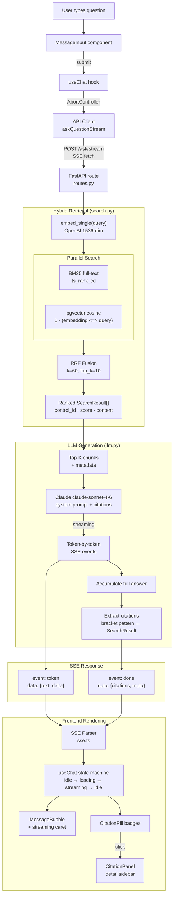
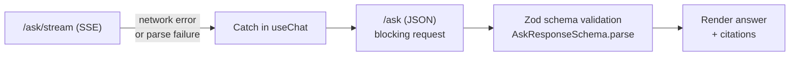
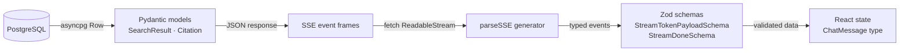

# Request Flow

How a user question travels from the browser to a cited answer.

## Query Pipeline

## Fallback Path

If SSE streaming fails, the client automatically falls back to the JSON endpoint.

## Type Safety Chain

Data is validated at every boundary crossing:

## Response Timing

| Phase | What happens | Measured by |
|-------|-------------|-------------|
| Embedding | Query → 1536-dim vector | — |
| Search | BM25 + vector parallel, RRF merge | — |
| First token | Claude starts generating | `time.monotonic()` |
| Streaming | Tokens arrive via SSE | Client renders incrementally |
| Done | Citations extracted, meta sent | `latency_ms` in meta payload |
