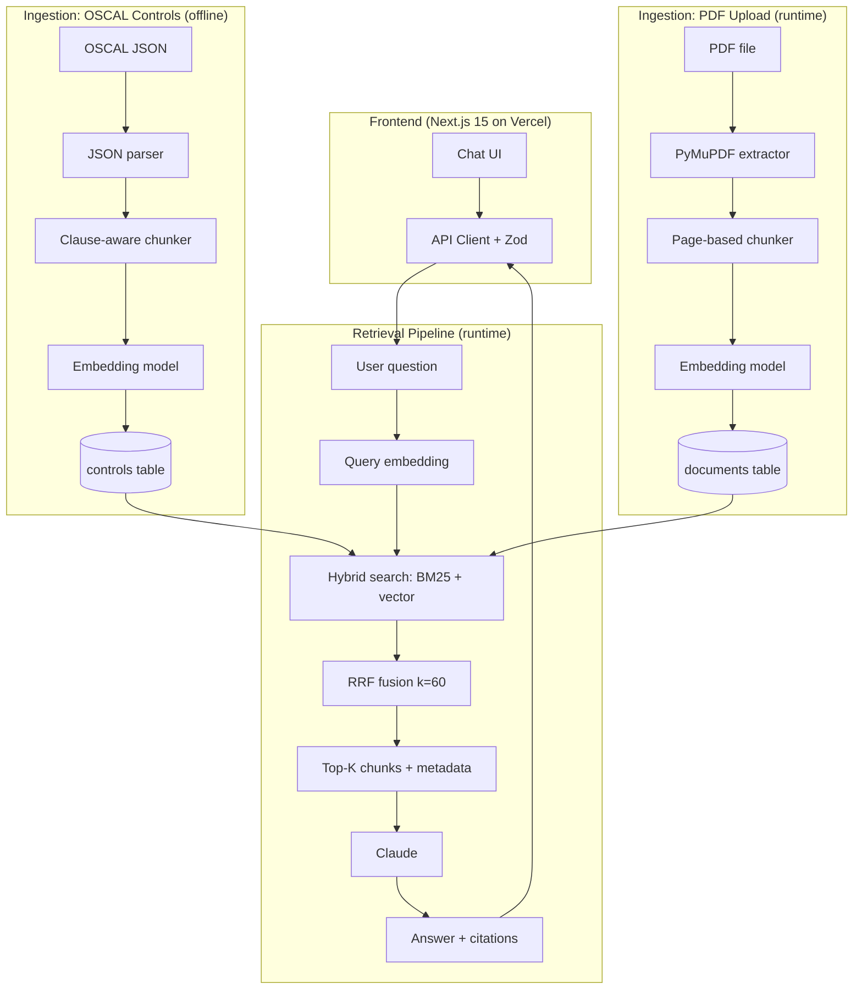

# PR-0.6.0 — Frontend Chat UI + RAG Pipeline + Monorepo Restructure

**Branch:** `feat/frontend` → `main`
**Version:** `0.6.0`
**Date:** 2026-05-03
**Status:** ✅ Ready to merge (tests deferred to PACKET-07)

---

## Summary

Ships the complete working demo for the Calibre interview: a Next.js chat UI backed by a fully wired RAG pipeline. Users can type compliance questions and get grounded answers with citation pills referencing NIST SP 800-53 controls, or upload PDFs for document-level search. Also restructures the project into a `backend/` + `frontend/` monorepo layout.

## What's in the Box

### Backend — RAG Pipeline

11 Python modules in `backend/app/` (~1,040 lines):

| Module | Purpose |
|--------|---------|
| `routes.py` | `/health`, `/ask`, `/upload` endpoints |
| `search.py` | Hybrid BM25 + vector search with RRF fusion (k=60) |
| `llm.py` | Claude answer generation with compliance system prompt |
| `embeddings.py` | OpenAI `text-embedding-3-small` batch embedding |
| `chunker.py` | OSCAL JSON catalog parser (1,014 controls) |
| `pdf.py` | PyMuPDF text extraction + page-aware chunking |
| `db.py` | asyncpg pool lifecycle + idempotent schema creation |
| `models.py` | Pydantic models aligned with frontend Zod schemas |
| `config.py` | Settings with env var binding |
| `main.py` | App factory with lifespan, CORS, `ISO_AUDIT_TESTING` bypass |
| `__init__.py` | Package marker |

Supporting:
- `scripts/ingest.py` — Offline OSCAL ingestion CLI
- `scripts/create-schema.sql` — Idempotent Postgres + pgvector schema
- `data/NIST_SP-800-53_rev5_catalog.json` — 10MB OSCAL catalog

### Frontend — Chat UI

10 React components following the 4-file pattern (`Component.tsx`, `.types.ts`, `index.ts`, `useComponent.ts`):

Chat, MessageList, MessageInput, MessageBubble, EmptyState, CitationPanel, CitationPill, MetaFooter, UploadButton, Toast.

Key features:
- **Strict TypeScript** — all 8 flags, zero `any`, zero `as` assertions
- **Zod validation** at every fetch boundary (askQuestion, uploadDocument, checkHealth)
- **Markdown rendering** with `react-markdown` + citation pill extraction
- **PDF upload** with XHR progress tracking, file picker, toasts
- **Responsive layout** — `dvh` units, `sm:` breakpoints

### Infrastructure

- **Monorepo restructure** — `app/` → `backend/app/`, symmetric with `frontend/`
- **Husky v9** — pre-commit, commit-msg (Golden Goose Rule), pre-push
- **Frontend CI** — lint → type-check → build (Node 20, `frontend/**` path filter)
- **Backend CI** — lint → type-check → test with `ISO_AUDIT_TESTING=1` (`backend/**` path filter)
- **Vercel config** — `vercel.json` with security headers
- **EC2 deployment** — systemd service file in `systemd/`

## Architecture

## Files Changed

| Directory | Action | Notes |
|-----------|--------|-------|
| `backend/app/` | Created (restructured) | 11 modules, full RAG pipeline |
| `backend/scripts/` | Created | Ingestion CLI + schema SQL |
| `backend/data/` | Created | NIST OSCAL catalog |
| `backend/tests/` | Created | Health endpoint test + conftest |
| `frontend/` | Created | Next.js 15 + React 19 + Tailwind 4 |
| `frontend/src/components/` | Created | 10 components, 4-file pattern each |
| `frontend/src/lib/api/` | Created | Zod-validated API client |
| `.github/workflows/frontend-ci.yml` | Created | Node 20 CI pipeline |
| `.github/workflows/backend-ci.yml` | Modified | Monorepo paths + ISO_AUDIT_TESTING |
| `.husky/` | Created | 3 hooks |
| `systemd/` | Created | EC2 service file |
| `docs/build-packets/PACKET-07-*.md` | Created | Test suite packet spec |
| `docs/cursor-tasks/PACKET-07/` | Created | 12 cursor task specs |

## Architecture Decisions

| Decision | Why |
|----------|-----|
| Hybrid BM25 + vector + RRF fusion | Simpler than a separate reranker model; k=60 matches literature |
| asyncpg raw queries, no ORM | Keeps pgvector operations explicit for a small schema |
| `ISO_AUDIT_TESTING=1` flag | CI and tests run without Postgres; lifespan skips pool init |
| UploadResponse with `document_id` UUID | Aligned backend Pydantic with frontend Zod to prevent runtime mismatch |
| Next.js 15 App Router | Latest stable, RSC where beneficial |
| Tailwind 4, no component library | Custom Claude-style design needs full control |
| Zod at every fetch boundary | Never trust external data with `as Type` |
| XHR for uploads | `upload.onprogress` for real progress bars |
| Monorepo layout (`backend/` + `frontend/`) | Symmetric structure, clean CI path filters |

## Testing Checklist

### Backend
- [x] `ISO_AUDIT_TESTING=1 uv run pytest -v` — passes
- [x] `uv run ruff check .` — clean
- [x] `uv run mypy --strict app/ scripts/ tests/` — clean (13 modules)
- [x] App imports cleanly with ISO_AUDIT_TESTING=1
- [x] `/ask` endpoint returns structured AskResponse with citations
- [x] `/upload` endpoint validates PDF, chunks, embeds, returns document_id
- [x] Hybrid search returns ranked results with RRF scores

### Frontend
- [x] `npx tsc --noEmit` — strict type check passes
- [x] `npm run lint` — clean
- [x] `npm run build` — production build succeeds
- [x] Zero `any` types, zero `as` assertions
- [x] Zod validation on all 3 API response boundaries
- [x] All 10 components follow 4-file pattern
- [x] All source files have header comments
- [x] Chat sends questions and displays answers with citations
- [x] PDF upload with progress tracking and toasts
- [x] Responsive layout

### Pending (PACKET-07)
- [ ] Backend unit tests (6 test files, ~20 tests)
- [ ] Frontend component tests (4 test files, ~15 tests)
- [ ] Frontend CI test step
- [ ] Test infrastructure (Vitest + React Testing Library)

## Deployment Notes

- **Frontend** → Vercel via GitHub integration (auto-deploy on merge to `main`)
- **Backend** → EC2 with Nginx reverse proxy + systemd service
- **Database** → Neon PostgreSQL with pgvector extension
- Set `NEXT_PUBLIC_API_URL` in Vercel → `https://api.iso-audit.manumustudio.com`
- Set `DATABASE_URL`, `OPENAI_API_KEY`, `ANTHROPIC_API_KEY` on EC2 via SSM or .env
